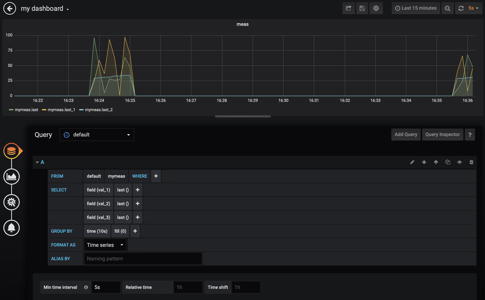

## sample for Lambda and Influxdb

- 参考
    + ここのURLの通りにやってみた
    https://aws.amazon.com/jp/blogs/news/influxdb-and-grafana-with-aws-iot-to-visualize-time-series-data/

### 以下、動作時のメモ
#### influx db

- DBの設定
```
use awsblog
```

- データの投入
```
insert example,sample1="xxx" value=0.01
```
これは、exampleというmeasurementに、タグ`sample1`に`xxx`を設定し、さらに`value`を`0.01`を設定するということ<br>
タグは可視化のときにデータの仕分けに使われるらしい

#### influxDBのエンドポイントからの取得
ポートさえ開けておけば、POSTしたりGETしたりできる<br>
この例はEC2上にたてたinfluxDBからGETしてる様子。<br>
普通は外側からはアクセスできるようにはしないだろうけど。

```
curl -G 'http://<ec2-endpoint>:8086/query?pretty=true' --data-urlencode "db=awsblog" --data-urlencode "q=SELECT * FROM mymeas"
```

#### influxDBに定期的にデータを入れるコマンド
今回、ブログの例とはちょっと違うが、Lamdaから入れたので。<br>
API Gateway -> Lambda -> LambdaがInfluxDBに入れる
```
while true; do date; curl https://<api-gateway-endpoint>/default/awsblog-lambda ; sleep 1 ;done
```

#### lamdaの更新
```
aws lambda update-function-code --function-name awsblog-lambda --zip-file fileb://lambda.zip
```
`awsblog-lambda`というLamda関数を更新する<br>
lambda.zipに`node_module`とか全部入れてアップすると勝手に配置される。

## Grafanaの設定の例


